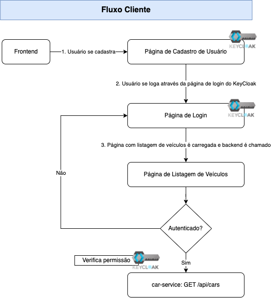
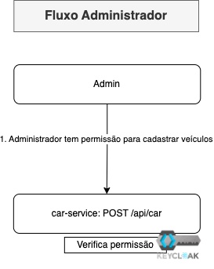

# auth-stack-react-sboot-keycloak

Stack com projetos React, Java e Keycloak para exercitar fluxos de Autenticação e Autorização.

Projetos criados com Java/Spring Boot, NodeJS e KeyCloak (via Docker).

# Fluxos cobertos





# Setup para execução local

## Criação do KeyCloak

```
docker run -p 8999:8080 -e KC_BOOTSTRAP_ADMIN_USERNAME=admin -e KC_BOOTSTRAP_ADMIN_PASSWORD=admin quay.io/keycloak/keycloak:26.1.3 start-dev
```

## Setup KeyCloak

* Acessar: http://localhost:8999/admin/master/console/

* Criar Realm
-> Create Realm

* Permitir auto-cadastro de usuário
    * -> Realm Settings -> Login ->  habilitar User Registration   

* Criar Client "car-customer-client"
    * -> Clients -> criar "car-customer-client" com Openid Connect, Valid Redirect Uris e Valid post logout uRIS com "http://localhost:3002/*" e Web Origins com http://localhost:3002"
    * -> Clients -> selecionar "car-customer-client" -> Roles -> criar role "get-operations"

* Criar Client "car-admin-client"
    * -> Clients -> criar "car-admin-client" com Openid Connect
    * -> Clients -> selecionar "car-admin-client" -> Roles -> criar role "admin-operations" e criar role "get-operations"

* Adicionar role get-operations para auto-cadastro de usuário
    * -> Realm Settings -> Roles ->  adicionar a role "get-operations" de "car-customer-client"

* Criar usuário admin
    * -> Credentials -> adicionar senha (desmarcar opção temporária)
    * -> Role Mapping -> adicionar a role "admin-operations" do "car-admin-client"
    * -> Role Mapping -> adicionar a role "get-operations" do "car-admin-client"


## Aplicação frontend

``` 
npm install ./auth-stack-react-sboot-keycloak/car-frontent
npm start ./auth-stack-react-sboot-keycloak/car-frontent 
```

## Aplicação backend

```
mvn clean install ./auth-stack-react-sboot-keycloak/car-backend
mvn spring-boot:run ./auth-stack-react-sboot-keycloak/car-backend
```
